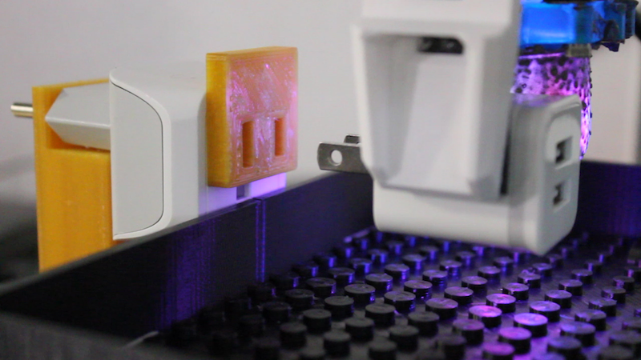

This repository contains code for operating the tactile sensor testbench (modified 3 axis CNC), as well as model training code written in PyTorch. 

It accompanies the paper [OmniTact: A Multi-Directional High Resolution Touch Sensor](https://arxiv.org/abs/2003.06965),
 by Akhil Padmanabha, Frederik Ebert, Stephen Tian, Roberto Calandra, Chelsea Finn, and Sergey Levine, to appear in the International Conference on Robotics and Automation (ICRA) 2020.

Paper website: https://sites.google.com/berkeley.edu/omnitact

### Instructions
To run a control experiment on a dummy environment or on the testbench, create a configuration file and run it per the following example:

`python run/run.py <experiment_config> <num_trajectories>`

For a concrete example, the command `python run/run.py keyboard_control_dummy 5` 
rolls out 5 trajectories in a dummy environment, using a policy which queries the user to enter actions via the keyboard.

To train a model using data collected using the `run` script, create a model configuration file and train the model using

`python scripts/train.py <model_config>`

for example

`python scripts/train.py models/experiments/y_reg/y_reg_rand.yaml`

trains a model which regresses the XYZ location of the end effector from tactile images.

Further hardware, electronics, firmware, and software documentation is provided in `/doc/README.md`. 

 
