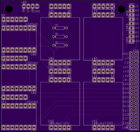

# Hardware
[Link to CAD files for the hardware setup](https://drive.google.com/drive/u/3/folders/1_D5uNwMah01uUej5cnVeReErW3PcaLc2?usp=drive_open)

The rig is a [2418 "Engraving Machine"](https://www.amazon.com/DIY-Laser-CNC-Kit-Engraving/dp/B01N2510KF/) purchased from Amazon (this link is not quite the one used to purchase the one currently built, because the original link now redirects to a [fancier looking](https://www.amazon.com/Control-Engraving-240x180x45mm-Beauty-Star/dp/B07169D9JQ) one. The dimensions should be verified if purchasing another one of these. 

To begin setup of the bench, there are nice instructions [here](https://imgur.com/gallery/NGafu) which you can follow for the hardware setup.

Once that's set up, there are a few "upgrades" we've made to the rig for our purposes. First of all, limit switches are installed on the X, Y, and Z axes (we call the X axis the one which actually moves the base plate of the rig, the Z axis the one that goes vertically up and down, and Y is the remaining one). The limit switches used are mentioned on the BOM, and for the X and Y axes, are mounted to 3d printed hats which are "friction fit" onto the clamps for the smooth metal rods in each direction. 

*For the X axis, there are two possible mounting locations for the "hat". These are in the "back", closer to the Y axis/electronics, etc, and in the "front". Either location is okay for mounting. We use the "back" mounting location for the ball bearing task, and the "front" for the others, since the bulkier tasks don't allow the CNC to travel to the location without hitting anything.* **If you use the front mounting position, ensure that the environment portion of the config file specfies that the x-direction should be flipped (coming soon).

For the Z axis, the screws on the end of the Z axis motor are removed, pushed through a 3d printed part, and into their original place. The Z axis limit switch is then mounted to this 3d printed part. Unfortunately this mounting method doesn't work very well -- it would be good to find a better alternative.

Additionally, four load cells from Sparkfun (again, linked in BOM) have been added underneath the working surface. They are sandwiched by two pieces of aluminum, which have had holes waterjet cut into them for mounting.

# Electronics
The CNC kit comes with a main electronics board which contains a microcontroller, but we instead do most of the work using our own Arduino Mega for control. In order to support all the extra electronics (load cells, limit switches) added on, we also build a custom PCB which should be mounted next to the original electronics board. At this time, the only purpose that the original, CNC electronics board has is **to provide power to the stepper motors**. This is accomplished by wiring out the bottom rows of pins from where the stepper motors used to be, on the original board, to the corresponding pins on the custom board. 

The PCB looks like 

on the front. Header pins of some kind (male, female) are soldered to all of the through holes, depending on how the external connector works. 

A brief lay of the land: On the left middle-bottom column, are the locations of the three stepper motor drivers.

**Important: The stepper motor drivers get hot during operation. Be careful!**

 In the middle, the largest section is devoted to four boards for reading the load cells. On the top left are pins where the limit switches plug in, and the dense pins in the bottom right connected to the Arduino via a direct physical stacking. In the top left are three optional pins that can be used to wire LEDs for sensors (TODO describe this). *Note that if you are using these pins, you will likely want to solder resistors as shown in the silkscreen, under the top left load cell board.*

The full PCB schematic (Eagle file) is available as a link in the BOM. 

Assuming everything is wired, to run the machine, the Arduino needs to be connected to the computer via USB, and the original CNC electronics board needs to be connected to power via the AC Adapter.

# Software
This repository contains a few things. The first is the firmware code that runs on the Arduino Mega. This is the low level code that describes routines such as moving to a certain position, reading out sensor values, etc. Most likely, this does not need to be modified and will continue to live on the Arduino. If this does need to be changed, program the Arduino through the [Arduino IDE program](https://www.arduino.cc/en/Guide/Linux). 

A library is required here, for the HX711 load cells. The specific commit version of the library to download is [here:](https://github.com/bogde/HX711/tree/e80de1c07e). The library has since been updated which breaks the firmware code. So the easiest way is to install from the link above into the local Arduino library folder.

Next is Python (3, although not tested with 2) code which interfaces with the Arduino firmware via serial, which can be found in `testbench_control.py`. This code abstracts away all of the serial communication and common functionality, so that you can simply create a Python script, declare a `TestBench` object, say, `tb = TestBench('/dev/ttyACM0', 0)`, where the first two arguments are the serial port which the testbench is connected to and the second is the camera index we would like to read from. The serial port argument is almost always `/dev/ttyACM0` on Linux machines with one Testbench connected. 

To use the code in this repository, Making a virtual environment is highly recommended. In your environment, go into this directory and type `pip install -r requirements.txt` to automatically install required packages. 

## Programming Notes
The code provides an OpenAI-Gym-like environment to run the testbench from. Experiments are specified using config files, which specify the environment, policy, and other settings.
To begin writing your own code, create a subclass of `Policy`.
The main entry point is to supply the config `yaml` file to run to `run.py`, which will begin rollouts.